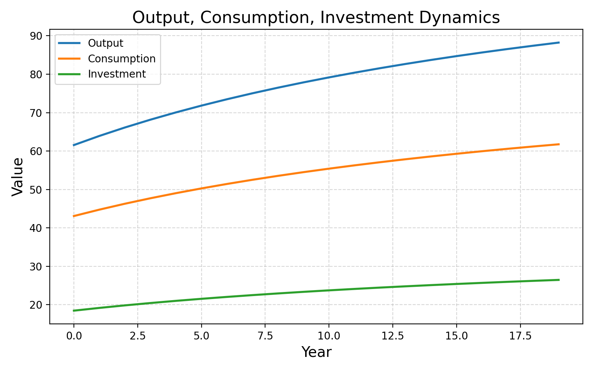
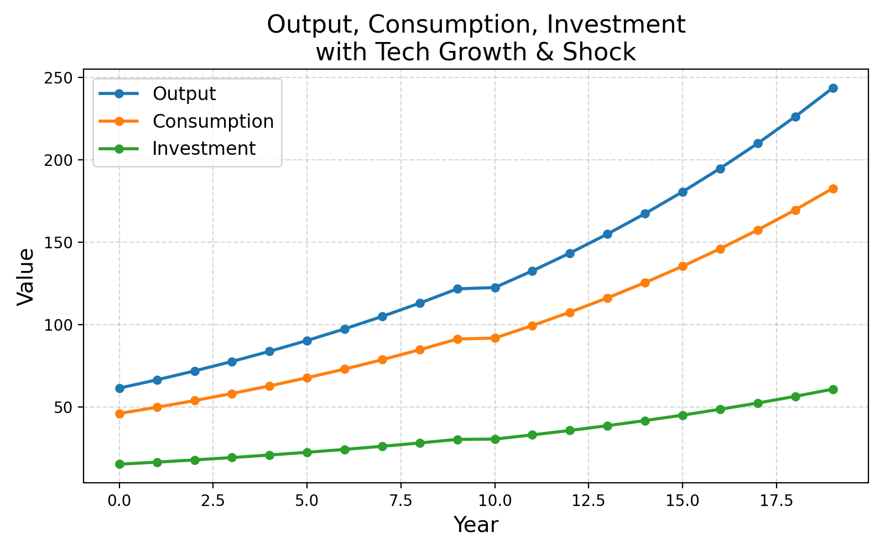

# DCGE Simulation Project

This repository provides a minimal dynamic computable general equilibrium (DCGE) simulation using a simple Cobb–Douglas production framework and social accounting table (SAM) calibration. It generates time-series outputs and Sankey diagrams for visualizing economic flows.

## Prerequisites

- Python 3.8+
- pandas
- matplotlib
- (Optional) plotly for interactive Sankey diagrams

## Installation

1. Clone the repository:
   ```bash
   git clone https://github.com/yourusername/dcge_minimal.git
   cd dcge_minimal
   ```
2. Install dependencies:
   ```bash
   pip install -r requirements.txt
   ```

## Data

- ``: Simplified social accounting table. Rows and columns correspond to sectors and institutional accounts (e.g., Agriculture, Manufacturing, Household, Investment, ValueAdded, etc.).
- You can update `sam_base_basic.csv` or create your own SAM. Use `sam_base.csv` as an example including non-zero investment values.

## Running the Simulation

Execute the main script to run calibration, simulation, and visualization:

```bash
python run_dcge.py
```

This will:

- Calibrate consumption shares and investment share from your SAM.
- Simulate 20 periods of growth with Cobb–Douglas production.
- Generate the following in `results/`:
  - `dcge_simulation.csv`: Time-series data for Year, Output, Consumption, Investment, Capital.
  - `capital_path.png`: Capital stock path graph.
  - `dynamics.png`: Output, Consumption, Investment dynamics graph.

## Adding Technology Growth & Shock

The function `simulate_dcge_with_tech_shock` in `run_dcge.py` allows:

- **Technology growth**: Annual increase in productivity.
- **External shock**: Sudden drop in capital in a specified year. Example usage is included in the script; results saved as `capital_path_tech_shock.png` and `dynamics_tech_shock.png`.


